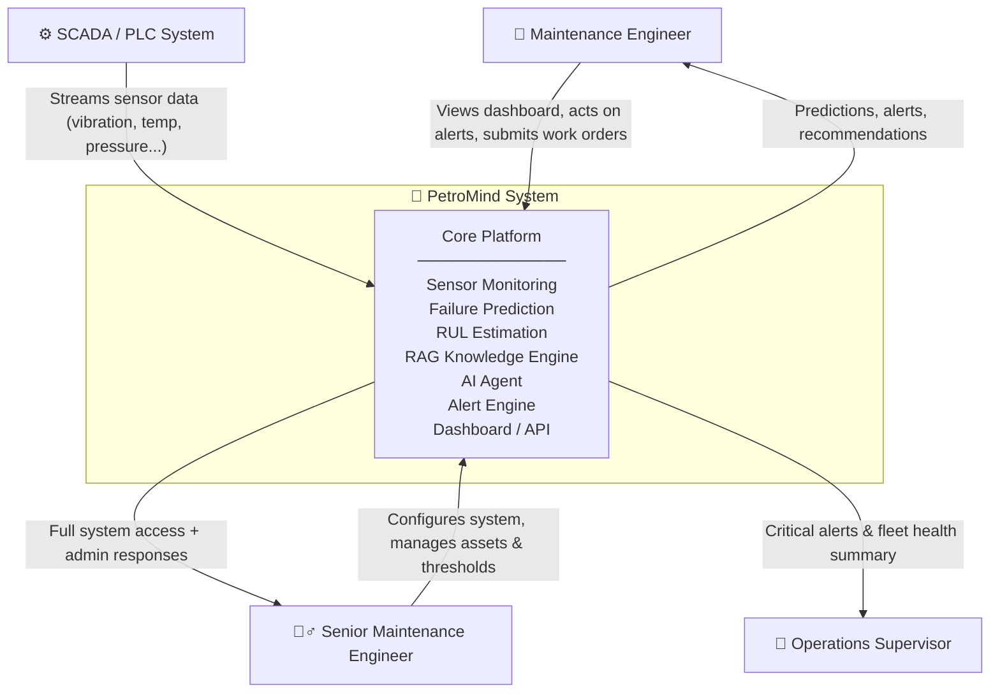
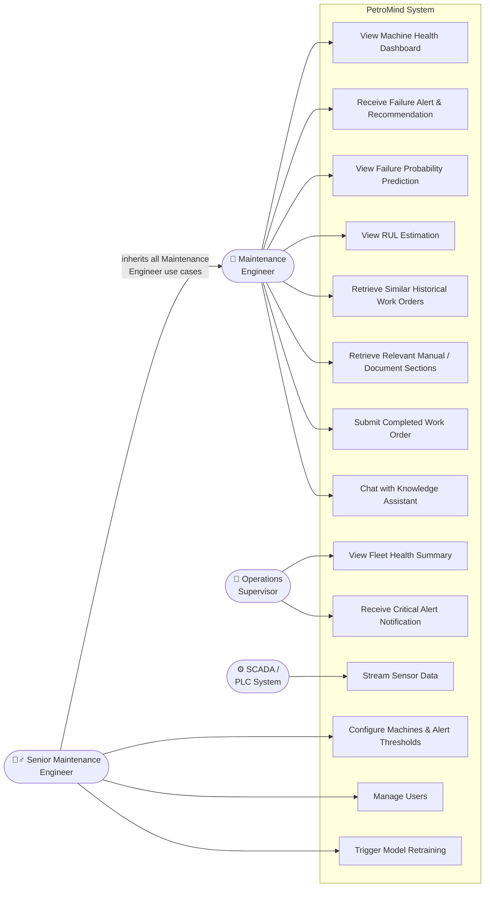
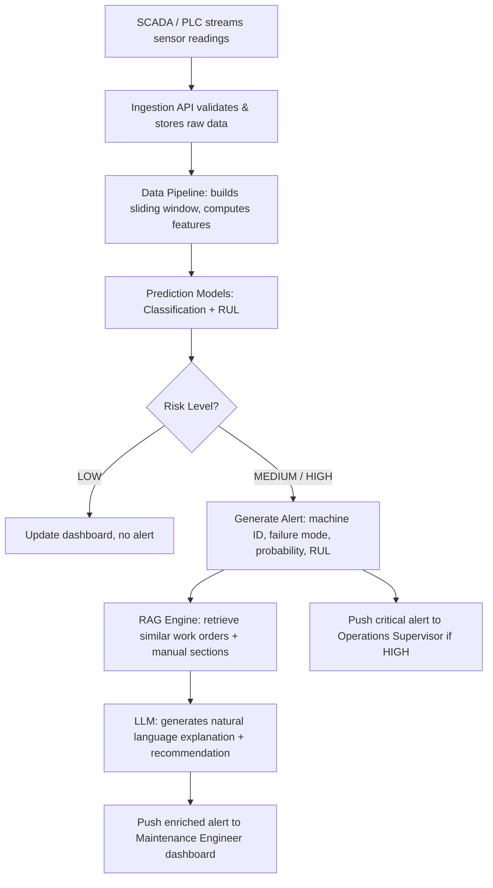
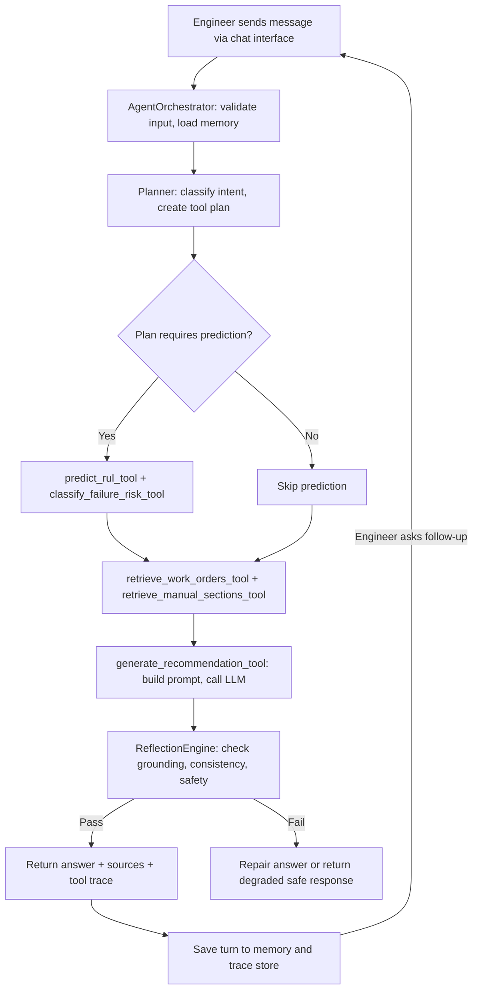
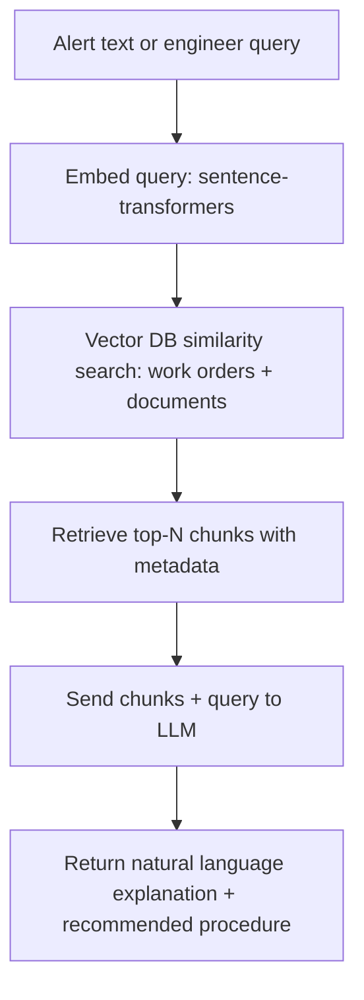
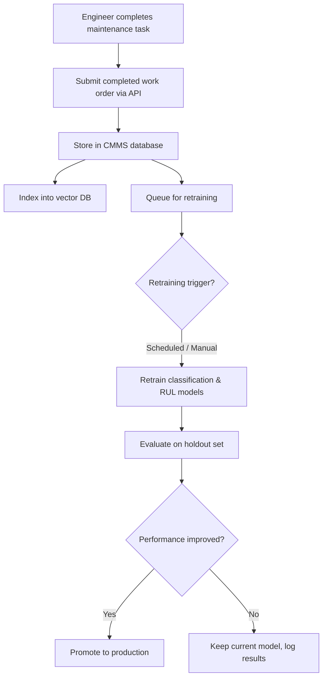

# PetroMind — System Analysis & Architecture
### Predictive Maintenance & AI Knowledge Integration System
**Prepared by:** PetroMind Engineering Team  
**Last Updated:** 2026-06-28  
**Status:** ML pipeline complete · AI Agent in progress · FastAPI serving in progress · Docker in progress

---

## Table of Contents

1. [Project Overview](#1-project-overview)
2. [Problem Statement](#2-problem-statement)
3. [Actors](#3-actors)
4. [System Context Diagram](#4-system-context-diagram)
5. [Use Case Diagram](#5-use-case-diagram)
6. [Use Case Descriptions](#6-use-case-descriptions)
7. [User Stories](#7-user-stories)
8. [Acceptance Criteria](#8-acceptance-criteria)
9. [Functional Requirements](#9-functional-requirements)
10. [Non-Functional Requirements](#10-non-functional-requirements)
11. [System Components](#11-system-components)
12. [Data Description](#12-data-description)
13. [System Flow](#13-system-flow)
14. [Error Handling & Edge Cases](#14-error-handling--edge-cases)
15. [Assumptions & Constraints](#15-assumptions--constraints)
16. [ML Pipeline Summary](#16-ml-pipeline-summary)
17. [AI Agent Architecture](#17-ai-agent-architecture)
18. [FastAPI Endpoints](#18-fastapi-endpoints)

---

## 1. Project Overview

**PetroMind** is an end-to-end industrial predictive maintenance and knowledge integration system. It continuously monitors sensor data from industrial machines (vibration, temperature, pressure, current, flow), predicts failure risk and Remaining Useful Life (RUL), and enriches its output with a Retrieval-Augmented Generation (RAG) knowledge layer that retrieves relevant historical work orders, equipment manuals, and technical documents. Engineers interact with this knowledge layer through a **conversational AI agent** — asking questions in natural language, getting context-aware answers grounded in real maintenance history and technical documentation, with full conversation memory across follow-up questions.

**Who uses it:**
- Maintenance engineers who respond to machine alerts and need actionable recommendations
- Senior maintenance engineers who configure the system and manage assets
- Operations supervisors who need a high-level view of fleet health

**What problem it solves:**  
It replaces reactive, unplanned maintenance with data-driven, proactive decision-making — reducing downtime, enabling smarter scheduling, and surfacing relevant institutional knowledge at the moment it is needed.

---

## 2. Problem Statement

> The problem is that industrial facilities currently rely on reactive or schedule-based maintenance, which leads to unplanned machine downtime, excessive maintenance costs, and loss of operational knowledge. Maintenance engineers lack a unified system that combines real-time sensor monitoring, intelligent failure prediction, and instant access to historical fixes and technical documentation — resulting in slow diagnosis, repeated mistakes, and high dependency on individual expertise.

---

## 3. Actors

| Actor | Type | Description |
|---|---|---|
| **Maintenance Engineer** | Human (Primary) | Operates the system daily. Views machine health, acts on alerts, retrieves work orders and manual sections, submits completed maintenance records. |
| **Senior Maintenance Engineer** | Human (Admin) | Has full access to everything the Maintenance Engineer can do, plus system configuration: adding machines, setting alert thresholds, managing users, and triggering manual retraining. |
| **Operations Supervisor** | Human (Secondary) | Receives critical alerts and views fleet-level health summaries. Does not interact with machine-level details directly. |
| **SCADA / PLC System** | External System | Streams raw sensor readings (vibration, temperature, pressure, etc.) into the platform continuously. Acts as the primary data source for real-time monitoring. |

---

## 4. System Context Diagram



---

## 5. Use Case Diagram



> **Note:** Senior Maintenance Engineer inherits all use cases of Maintenance Engineer, in addition to admin-specific use cases (UC11–UC13).

---

## 6. Use Case Descriptions

### UC1 — View Machine Health Dashboard

| Field | Detail |
|---|---|
| **Actor** | Maintenance Engineer, Senior Maintenance Engineer |
| **Trigger** | Engineer logs into the system or navigates to a machine |
| **Precondition** | Sensor data is being ingested; machine exists in the system |
| **Main Flow** | 1. Engineer selects a machine. 2. System displays machine ID, type, location. 3. System displays live or latest sensor readings and trend plots. 4. System displays current failure probability and RUL estimate. |
| **Outcome** | Engineer has a clear snapshot of machine health status |
| **Alternate Flow** | If sensor data is unavailable, system shows last known values with a staleness warning |

### UC2 — Receive Failure Alert & Recommendation

| Field | Detail |
|---|---|
| **Actor** | Maintenance Engineer, Senior Maintenance Engineer |
| **Trigger** | Failure probability exceeds threshold (e.g., > 0.8) OR RUL drops below threshold (e.g., < 48 hours) |
| **Precondition** | Prediction models are running; thresholds are configured |
| **Main Flow** | 1. System detects high-risk condition. 2. System generates alert with machine ID, predicted failure mode, failure probability, and estimated RUL. 3. System calls RAG engine to retrieve top-N similar past work orders and relevant manual sections. 4. Alert is pushed to engineer's dashboard with recommended actions. |
| **Outcome** | Engineer receives a full alert with context — what might fail, when, and what to do about it |
| **Alternate Flow** | If RAG retrieval returns no results, alert is sent without recommendation (system notes "no similar cases found") |

### UC3 — View Failure Probability Prediction

| Field | Detail |
|---|---|
| **Actor** | Maintenance Engineer, Senior Maintenance Engineer |
| **Trigger** | Engineer requests prediction for a specific machine |
| **Precondition** | Recent sensor window available for the machine |
| **Main Flow** | 1. Engineer selects machine. 2. System builds latest sensor window. 3. System runs classification model. 4. System returns failure probability for the next T hours and risk level (LOW / MEDIUM / HIGH). |
| **Outcome** | Engineer sees quantified risk level with confidence |

### UC4 — View RUL Estimation

| Field | Detail |
|---|---|
| **Actor** | Maintenance Engineer, Senior Maintenance Engineer |
| **Trigger** | Engineer requests RUL for a specific machine |
| **Precondition** | Recent sensor window available; RUL model is deployed |
| **Main Flow** | 1. Engineer selects machine. 2. System runs RUL regression model on latest window. 3. System returns estimated remaining useful life in hours or cycles. |
| **Outcome** | Engineer can plan maintenance scheduling proactively |

### UC5 — Retrieve Similar Historical Work Orders

| Field | Detail |
|---|---|
| **Actor** | Maintenance Engineer, Senior Maintenance Engineer |
| **Trigger** | Alert is generated OR engineer manually searches |
| **Precondition** | Work order vector database is populated |
| **Main Flow** | 1. System converts the current problem description to an embedding. 2. System performs similarity search in the work order vector DB. 3. System returns top-N similar past cases with problem description, action taken, outcome, and date. |
| **Outcome** | Engineer sees what similar problems looked like in the past and what fixed them |

### UC6 — Retrieve Relevant Manual / Document Sections

| Field | Detail |
|---|---|
| **Actor** | Maintenance Engineer, Senior Maintenance Engineer |
| **Trigger** | Alert is generated OR engineer manually queries |
| **Precondition** | Document vector database is populated with embedded manual chunks |
| **Main Flow** | 1. System converts anomaly description to embedding. 2. System searches manual/document vector DB. 3. Relevant chunks are retrieved with metadata. 4. Chunks are sent to LLM to generate a natural language explanation and recommended procedure. |
| **Outcome** | Engineer receives a plain-language explanation of the likely cause with references to official documentation |

### UC7 — Submit Completed Work Order

| Field | Detail |
|---|---|
| **Actor** | Maintenance Engineer, Senior Maintenance Engineer |
| **Trigger** | Maintenance task is completed |
| **Precondition** | Work order was generated or exists in CMMS |
| **Main Flow** | 1. Engineer fills in confirmed failure mode, action taken, and actual downtime. 2. System stores the completed record in the CMMS database. 3. Record is queued for next periodic retraining cycle. 4. Record is indexed into the work order vector DB for future retrieval. |
| **Outcome** | System knowledge base grows with each resolved case; models improve over time |

### UC8 — View Fleet Health Summary

| Field | Detail |
|---|---|
| **Actor** | Operations Supervisor |
| **Trigger** | Supervisor logs in or requests overview |
| **Precondition** | Multiple machines are being monitored |
| **Main Flow** | 1. Supervisor opens fleet dashboard. 2. System displays all machines with their current risk level (color-coded: LOW / MEDIUM / HIGH). 3. Summary shows total machines, machines at risk, and machines scheduled for maintenance. |
| **Outcome** | Supervisor has a high-level picture of operational risk across the facility |

### UC9 — Receive Critical Alert Notification

| Field | Detail |
|---|---|
| **Actor** | Operations Supervisor |
| **Trigger** | A machine reaches HIGH risk level |
| **Precondition** | Notification channel is configured for the supervisor |
| **Main Flow** | 1. System detects HIGH risk condition. 2. System sends critical alert to Operations Supervisor. 3. Alert includes machine ID, location, risk level, and estimated RUL. |
| **Outcome** | Supervisor is immediately aware of critical situations without needing to monitor the system actively |

### UC10 — Stream Sensor Data

| Field | Detail |
|---|---|
| **Actor** | SCADA / PLC System |
| **Trigger** | Continuous (every Δt, e.g., every minute) |
| **Precondition** | SCADA integration is configured; machine tags are mapped |
| **Main Flow** | 1. SCADA pushes sensor readings (timestamp, machine_id, sensor_type, value). 2. System ingests and validates the data. 3. System appends to the time-series store. 4. System triggers window build and model inference. |
| **Outcome** | Latest sensor data is always available for prediction and monitoring |

### UC11 — Configure Machines & Alert Thresholds

| Field | Detail |
|---|---|
| **Actor** | Senior Maintenance Engineer |
| **Trigger** | New machine is added to facility OR thresholds need adjustment |
| **Main Flow** | 1. Senior engineer adds machine with ID, type, location, and install date. 2. Engineer maps sensor tags to the system schema. 3. Engineer sets alert thresholds (failure probability threshold, RUL threshold). |
| **Outcome** | New machine is monitored; alerts fire at appropriate sensitivity levels |

### UC12 — Manage Users

| Field | Detail |
|---|---|
| **Actor** | Senior Maintenance Engineer |
| **Trigger** | New team member joins or role changes |
| **Main Flow** | 1. Senior engineer creates or modifies user account. 2. Assigns role: Maintenance Engineer or Operations Supervisor. 3. System applies access permissions accordingly. |
| **Outcome** | Correct users have correct access levels |

### UC13 — Trigger Model Retraining

| Field | Detail |
|---|---|
| **Actor** | Senior Maintenance Engineer (manual trigger) / System (scheduled) |
| **Trigger** | Sufficient new completed work orders have accumulated OR senior engineer triggers manually |
| **Main Flow** | 1. System collects new labeled data from completed work orders. 2. System retrains classification and RUL models on updated dataset. 3. New model versions are evaluated against holdout set. 4. If performance improves, models are promoted to production. |
| **Outcome** | Models continuously improve as real plant data accumulates |

### UC14 — Chat with Knowledge Assistant

| Field | Detail |
|---|---|
| **Actor** | Maintenance Engineer, Senior Maintenance Engineer |
| **Trigger** | Engineer opens the chat interface — either from an active alert or independently |
| **Precondition** | RAG knowledge base is populated; LLM is accessible; AI Agent is deployed |
| **Main Flow** | 1. Engineer types a question. 2. Agent embeds the query and retrieves relevant work orders and manual chunks from the vector DB. 3. Agent builds a prompt containing conversation history + retrieved context + new question. 4. LLM generates a grounded, context-aware response. 5. Response and sources are displayed to the engineer. 6. Engineer can ask follow-up questions — conversation history is maintained throughout the session. |
| **Outcome** | Engineer gets accurate, sourced answers in natural language with full conversational context |
| **Alternate Flow** | If LLM is unavailable, system returns raw retrieved chunks with a note that the explanation service is down |

---

## 7. User Stories

### Maintenance Engineer

- As a maintenance engineer, I want to view the current health status of any machine, so that I can monitor its condition at a glance.
- As a maintenance engineer, I want to receive an alert when a machine is at high risk of failure, so that I can take action before unplanned downtime occurs.
- As a maintenance engineer, I want to see the failure probability and estimated RUL for a machine, so that I can prioritize which machines need immediate attention.
- As a maintenance engineer, I want to retrieve similar historical work orders when I receive an alert, so that I can learn what fixed the same problem in the past.
- As a maintenance engineer, I want to retrieve relevant sections from equipment manuals, so that I can follow the correct procedure without searching through documents manually.
- As a maintenance engineer, I want to submit a completed work order with the confirmed failure mode and action taken, so that the system's knowledge base stays up to date.
- As a maintenance engineer, I want to chat with a knowledge assistant in natural language, so that I can ask questions about machine problems and get grounded answers from historical work orders and manuals without manually searching through documents.

### Senior Maintenance Engineer

- As a senior maintenance engineer, I want all the capabilities of a maintenance engineer, so that I can directly participate in day-to-day operations.
- As a senior maintenance engineer, I want to register new machines and map their sensor tags, so that newly installed equipment is monitored from day one.
- As a senior maintenance engineer, I want to configure alert thresholds per machine, so that alerts fire at the right sensitivity for each asset type.
- As a senior maintenance engineer, I want to manage user accounts and assign roles, so that only authorized personnel access the system.
- As a senior maintenance engineer, I want to trigger model retraining manually or rely on scheduled retraining, so that models improve as real plant data accumulates.

### Operations Supervisor

- As an operations supervisor, I want to view a fleet-level health summary, so that I can assess overall operational risk without checking each machine individually.
- As an operations supervisor, I want to receive a critical alert notification when any machine reaches HIGH risk, so that I can plan resources and authorize emergency maintenance.

### SCADA / PLC System

- As a SCADA system, I want to push sensor readings to PetroMind continuously, so that the platform always has the latest data for predictions.

---

## 8. Acceptance Criteria

### UC1 — View Machine Health Dashboard

**Scenario 1 — Normal load:**
- **Given** the engineer is logged in and selects a machine
- **When** the dashboard loads
- **Then** the system displays machine ID, type, location, latest sensor readings, current failure probability, risk level, and RUL estimate within 2 seconds

**Scenario 2 — Stale data:**
- **Given** sensor data has not been received for more than the configured staleness threshold
- **When** the engineer views the dashboard
- **Then** the system displays the last known values with a visible staleness warning

### UC2 — Receive Failure Alert & Recommendation

**Scenario 1 — Alert triggered:**
- **Given** the failure probability for a machine exceeds the configured threshold (e.g., > 0.8)
- **When** the prediction cycle completes
- **Then** the system generates an alert containing machine ID, predicted failure mode, failure probability, estimated RUL, and timestamp, AND delivers it to the engineer's dashboard within 5 seconds

**Scenario 2 — RAG enrichment:**
- **Given** an alert has been generated
- **When** the RAG engine is called
- **Then** the system attaches top-N similar historical work orders and relevant manual sections to the alert before delivery

**Scenario 3 — No RAG results:**
- **Given** the RAG engine returns no results
- **When** the alert is delivered
- **Then** the alert is still sent with a note: "No similar historical cases found"

### UC3 — View Failure Probability Prediction

**Scenario 1 — Valid request:**
- **Given** a valid machine_id with recent sensor data available
- **When** the engineer requests a prediction
- **Then** the system returns failure probability (0.0–1.0) and risk level (LOW / MEDIUM / HIGH) within 2 seconds

### UC4 — View RUL Estimation

**Scenario 1 — Valid request:**
- **Given** a valid machine_id with recent sensor data available
- **When** the engineer requests RUL
- **Then** the system returns estimated RUL in hours or cycles within 2 seconds

### UC5 — Retrieve Similar Historical Work Orders

**Scenario 1 — Results found:**
- **Given** a problem description or alert text is provided
- **When** a similarity search is performed
- **Then** the system returns the top-N most similar work orders, each containing: problem description, action taken, failure mode, outcome, and date

**Scenario 2 — Empty database:**
- **Given** the vector database is empty
- **When** a retrieval is requested
- **Then** the system returns an empty result with message: "No work orders indexed yet"

### UC6 — Retrieve Relevant Manual / Document Sections

**Scenario 1 — Successful retrieval:**
- **Given** an anomaly description is provided
- **When** the RAG retrieval + LLM call completes
- **Then** the system returns a natural language explanation with references to specific document sections and metadata within 5 seconds

**Scenario 2 — LLM unavailable:**
- **Given** the LLM is unavailable
- **When** the retrieval completes
- **Then** the system returns the raw retrieved chunks without a generated explanation and logs the LLM failure

### UC7 — Submit Completed Work Order

**Scenario 1 — Successful submission:**
- **Given** the engineer fills in failure mode, action taken, and downtime
- **When** the work order is submitted
- **Then** the system stores the record, indexes it into the vector DB, queues it for retraining, AND returns a confirmation with the new work order ID

**Scenario 2 — Duplicate submission:**
- **Given** an identical work order was already submitted
- **When** a duplicate submission is attempted
- **Then** the system rejects the request and returns the existing record ID

### UC14 — Chat with Knowledge Assistant

**Scenario 1 — Successful conversational query:**
- **Given** the engineer opens the chat interface and types a question
- **When** the AI Agent processes the query
- **Then** the system returns a natural language answer grounded in retrieved work orders and/or manual sections, with source references, within 5 seconds

**Scenario 2 — Follow-up question with context:**
- **Given** the engineer has already asked one or more questions in the session
- **When** the engineer asks a follow-up question
- **Then** the system uses the full conversation history to generate a contextually accurate response without losing prior context

**Scenario 3 — LLM unavailable:**
- **Given** the LLM service is down
- **When** the engineer sends a message
- **Then** the system returns the raw retrieved chunks with a note: "Explanation service is currently unavailable"

**Scenario 4 — No relevant knowledge found:**
- **Given** the query does not match anything in the vector DB
- **When** retrieval returns empty results
- **Then** the system responds: "No relevant records found in the knowledge base for this query"

---

## 9. Functional Requirements

### 9.1 Grouped by Use Case

#### Sensor Monitoring (UC1, UC10)
- The system shall ingest real-time sensor readings from SCADA/PLC systems via a defined API interface.
- The system shall validate incoming sensor data (check for missing values, duplicate timestamps, out-of-range values).
- The system shall store raw sensor data in a Parquet-based time-series store indexed by machine_id and timestamp.
- The system shall build sliding windows of fixed size (e.g., 60 timesteps) for each machine upon receiving new readings.
- The system shall display current and historical sensor readings per machine on the engineer dashboard.

#### Failure Prediction (UC2, UC3)
- The system shall run a classification model on the latest sensor window to produce a failure probability for the next T hours.
- The system shall categorize risk level as LOW, MEDIUM, or HIGH based on configurable thresholds.
- The system shall display failure probability and risk level on the machine dashboard.

#### RUL Estimation (UC4)
- The system shall run a regression model on the latest sensor window to estimate Remaining Useful Life in hours or cycles.
- The system shall display RUL estimate on the machine dashboard alongside failure probability.

#### Alerting (UC2, UC9)
- The system shall generate an alert when failure probability exceeds the configured threshold OR RUL drops below the configured minimum.
- The system shall include machine ID, predicted failure mode, failure probability, RUL estimate, and timestamp in every alert.
- The system shall deliver alerts to Maintenance Engineers via the dashboard.
- The system shall deliver critical alerts to the Operations Supervisor via dashboard notification.

#### RAG — Work Order Retrieval (UC5)
- The system shall embed work order problem descriptions using sentence-transformers.
- The system shall store work order embeddings in a vector database with metadata (asset type, failure mode, date, technician).
- The system shall perform semantic similarity search given a current problem description or alert text.
- The system shall return the top-N most similar historical work orders with their problem, action taken, and outcome.

#### RAG — Document / Manual Retrieval (UC6)
- The system shall ingest technical documents (PDF, Word, scanned) via OCR and text extraction.
- The system shall chunk documents by section headers, failure modes, or procedure steps.
- The system shall embed document chunks and store them in the vector database with metadata (equipment type, manufacturer, section).
- The system shall retrieve the most relevant document chunks given an anomaly description.
- The system shall send retrieved chunks to an LLM to generate a plain-language explanation and recommended procedure.

#### Work Order Submission & Feedback Loop (UC7)
- The system shall allow engineers to submit completed work orders with confirmed failure mode, action taken, and downtime.
- The system shall store completed work orders in the CMMS database.
- The system shall index new work orders into the vector database for future retrieval.
- The system shall queue new completed records for the next model retraining cycle.

#### Fleet Overview (UC8)
- The system shall display a fleet-level dashboard showing all machines with their current risk levels.
- The system shall provide a summary count of machines per risk category (LOW / MEDIUM / HIGH).

#### System Configuration (UC11, UC12)
- The system shall allow Senior Maintenance Engineers to register new machines with ID, type, location, and install date.
- The system shall allow Senior Maintenance Engineers to map SCADA sensor tags to the internal schema.
- The system shall allow Senior Maintenance Engineers to configure alert thresholds per machine or globally.
- The system shall support user creation and role assignment (Maintenance Engineer, Operations Supervisor).

#### Conversational Knowledge Assistant — AI Agent (UC14)
- The system shall provide a chat interface accessible from the engineer dashboard.
- The system shall embed the engineer's query and retrieve relevant work orders and document chunks from the vector DB.
- The system shall maintain conversation history within a session and include it in every LLM prompt.
- The system shall build each LLM prompt as: `system_prompt + conversation_history + retrieved_context + new_message`.
- The system shall return the LLM response alongside source references (work order IDs, document section names).
- The system shall handle LLM unavailability gracefully by returning raw retrieved chunks with an error note.
- The system shall expose a `POST /api/v1/chat` endpoint accepting `session_id`, `message`, and optional `machine_id` context.
- The system shall support manual retraining initiated by the Senior Maintenance Engineer.
- The system shall evaluate retrained models before promotion using a holdout test set.
- The system shall split training data by time or by asset — never by random sampling — to prevent data leakage.

### 9.2 Flat List by Module

#### Data Ingestion & Processing Module
- **FR-D1:** The system shall ingest sensor data from SCADA via REST API or streaming interface.
- **FR-D2:** The system shall handle missing values via forward fill or interpolation.
- **FR-D3:** The system shall remove outliers using configurable statistical bounds.
- **FR-D4:** The system shall unify sensor sampling rates via resampling.
- **FR-D5:** The system shall validate timestamps for duplicates and correct ordering.
- **FR-D6:** The system shall store cleaned data as Parquet files partitioned by machine_id and date.
- **FR-D7:** The system shall build fixed-size sliding windows (default: 60 timesteps) per machine.
- **FR-D8:** The system shall compute per-window features: mean, std, RMS, max, min, skewness, rolling trend, FFT (for vibration).
- **FR-D9:** The system shall assign classification labels (failure within next T hours: 0/1) to each window.
- **FR-D10:** The system shall compute RUL labels (failure_time − current_time) for each timestep.
- **FR-D11:** The system shall enforce time-based or asset-based train/test splits — no random splitting.

#### Prediction Model Module
- **FR-M1:** The system shall train and serve a binary classification model for failure prediction.
- **FR-M2:** The system shall train and serve a regression model for RUL estimation.
- **FR-M3:** The system shall support baseline models (XGBoost / LightGBM) and sequence models (LSTM / 1D-CNN).
- **FR-M4:** The system shall expose a `POST /api/v1/predict/assessment` API endpoint accepting machine_id and sensor window, returning failure_probability, estimated_RUL, and risk_level.
- **FR-M5:** The system shall evaluate models using F1, ROC-AUC (classification) and MAE, RMSE (regression).

#### RAG Knowledge Module
- **FR-R1:** The system shall extract text from PDFs and scanned documents using pdfplumber and Tesseract OCR.
- **FR-R2:** The system shall clean extracted text (remove headers/footers, normalize formatting).
- **FR-R3:** The system shall chunk documents into 200–300 token segments with overlap.
- **FR-R4:** The system shall embed all text chunks using sentence-transformers.
- **FR-R5:** The system shall store embeddings in a vector database (Chroma or Qdrant) with structured metadata.
- **FR-R6:** The system shall expose a `POST /api/v1/rag/retrieve` API endpoint accepting a problem description, returning top-N similar work orders and relevant document chunks.
- **FR-R7:** The system shall pass retrieved chunks to an LLM and return a natural language maintenance recommendation.

#### AI Agent Module
- **FR-AG1:** The system shall implement a `AgentOrchestrator` that coordinates planning, tool execution, RAG retrieval, LLM generation, reflection, and guardrails.
- **FR-AG2:** The system shall implement a `Planner` that selects the sequence of tools based on user intent and available context.
- **FR-AG3:** The system shall implement a `MemoryManager` that maintains short-term session memory, persistent conversation history, and summary memory.
- **FR-AG4:** The system shall implement a typed `ToolRegistry` with allowlisted tools: `validate_sensor_file`, `predict_rul`, `classify_failure_risk`, `retrieve_work_orders`, `retrieve_manual_sections`, `summarize_sources`, `generate_recommendation`, `list_system_status`, `save_feedback`.
- **FR-AG5:** The system shall implement a `ReflectionEngine` that checks grounding, prediction consistency, risk threshold compliance, uncertainty language, and completeness before returning any final answer.
- **FR-AG6:** The system shall implement a `GuardrailEngine` that validates inputs, enforces tool allowlists, prevents prompt injection from retrieved documents, and validates LLM outputs.
- **FR-AG7:** The system shall expose agent lifecycle states: `created → input_validation → loading_context → planning → executing_tool → retrieving_knowledge → generating_response → reflecting → completed`.
- **FR-AG8:** The system shall degrade gracefully when the RAG index is empty, the LLM provider is unavailable, or model artifacts are missing.

#### Alert & Notification Module
- **FR-A1:** The system shall evaluate risk level after every prediction cycle.
- **FR-A2:** The system shall trigger an alert when risk_level is MEDIUM or HIGH.
- **FR-A3:** The system shall automatically call the RAG module to enrich each alert with recommendations.
- **FR-A4:** The system shall deliver alerts to Maintenance Engineers via dashboard.
- **FR-A5:** The system shall deliver critical (HIGH) alerts to Operations Supervisor via dashboard notification.

#### API & Integration Module
- **FR-I1:** `POST /api/v1/predict/rul` — RUL prediction.
- **FR-I2:** `POST /api/v1/predict/classifier` — failure risk classification.
- **FR-I3:** `POST /api/v1/predict/assessment` — combined ML assessment.
- **FR-I4:** `POST /api/v1/rag/retrieve` — semantic knowledge retrieval.
- **FR-I5:** `POST /api/v1/ingest/work-orders` — index work order records.
- **FR-I6:** `POST /api/v1/ingest/manuals` — index manual/PDF chunks.
- **FR-I7:** `POST /api/v1/chat` — AI Agent conversational endpoint (returns 501 until AgentOrchestrator is complete).
- **FR-I8:** `POST /api/v1/chat/stream` — streaming AI Agent responses.
- **FR-I9:** `POST /api/v1/sessions`, `GET /api/v1/sessions/{id}`, `GET /api/v1/sessions/{id}/messages`, `DELETE /api/v1/sessions/{id}` — session management.
- **FR-I10:** `POST /api/v1/feedback` — user feedback on predictions and responses.
- **FR-I11:** `GET /api/v1/health`, `GET /api/v1/ready`, `GET /api/v1/diagnostics` — system status.

---

## 10. Non-Functional Requirements

| ID | Category | Requirement |
|---|---|---|
| NFR-01 | Performance | The system shall return failure probability and RUL within 2 seconds of receiving a sensor window |
| NFR-02 | Performance | The RAG retrieval + LLM explanation shall complete within 5 seconds |
| NFR-03 | Scalability | The system shall support monitoring of at least 50 machines simultaneously in the prototype |
| NFR-04 | Availability | The prediction API shall target 99% uptime during operating hours |
| NFR-05 | Reliability | The system shall continue serving last-known predictions if sensor data stream is temporarily interrupted, with a clear staleness indicator |
| NFR-06 | Maintainability | The system shall be modular — data pipeline, model serving, RAG engine, AI agent, and API shall be independently deployable components |
| NFR-07 | Portability | The system shall be fully containerized with Docker and runnable locally or on a VM without cloud dependency |
| NFR-08 | Data Integrity | The system shall enforce no-leakage constraints on all training splits (time-based or asset-based only) |
| NFR-09 | Security | Only authenticated users shall access the API and dashboard; role-based access control shall be enforced |
| NFR-10 | Extensibility | The system shall support swapping public datasets for real plant data (Egyptian facility) with schema remapping only |
| NFR-11 | Observability | All agent runs shall emit structured logs with trace_id, lifecycle_status, tool names, latencies, and error types |
| NFR-12 | Safety | Agent recommendations shall always include uncertainty language and recommend certified technician verification for critical actions |

---

## 11. System Components

| Component | Technology | Role |
|---|---|---|
| **Sensor Ingestion API** | FastAPI | Receives SCADA sensor streams |
| **Data Processing Pipeline** | pandas, numpy, tsfresh | Cleaning, windowing, feature engineering |
| **Time-Series Store** | Parquet + DuckDB | Stores raw and windowed sensor data |
| **Classification Model** | LSTM (PyTorch) — F1 ≈ 0.98 | Predicts failure probability |
| **RUL Model** | LSTM (PyTorch) — RMSE ≈ 15.6 | Estimates remaining useful life |
| **Model Serving API** | FastAPI | Exposes `/predict/rul`, `/predict/classifier`, `/predict/assessment` |
| **CMMS Database** | SQLite / PostgreSQL | Stores work orders and maintenance events |
| **Document Ingestion Pipeline** | pdfplumber, PyPDF2, Tesseract | Parses and chunks manuals and documents |
| **Embedding Engine** | sentence-transformers (all-MiniLM-L6-v2) | Converts text to vector embeddings |
| **Vector Database** | Chroma / Qdrant | Stores and retrieves embedded work orders and document chunks |
| **LLM Integration** | External LLM API | Generates natural language explanations from retrieved chunks |
| **RAG API** | FastAPI | Exposes `/rag/retrieve`, `/ingest/work-orders`, `/ingest/manuals` |
| **AI Agent** | `petromind/agent/` package | Orchestrates planning, tool execution, memory, reflection, and guardrails |
| **Alert Engine** | Internal service | Evaluates thresholds and dispatches alerts |
| **Conversational Chat API** | FastAPI + AgentOrchestrator | `/chat` and `/chat/stream` endpoints |
| **Session & Memory Store** | SQLite | Stores sessions, messages, agent traces, prediction records, feedback |
| **Dashboard / Frontend** | Gradio (mounted in FastAPI) | Engineer and supervisor UI |
| **Experiment Tracking** | MLflow / W&B (optional) | Tracks model training runs and metrics |
| **Containerization** | Docker | Packages and deploys all components |

---

## 12. Data Description

### Sensor Data
```json
{
  "machine_id": "M-001",
  "timestamp": "2026-03-14T08:00:00Z",
  "sensor_type": "vibration_x",
  "value": 0.42
}
```

### Windowed Feature Data
```json
{
  "machine_id": "M-001",
  "window_start": "2026-03-14T07:00:00Z",
  "features": [0.42, 0.38, 0.91, "..."],
  "classification_label": 1,
  "rul_value": 36.5
}
```

### Maintenance Work Orders (CMMS)
```json
{
  "event_id": "WO-2024-1042",
  "machine_id": "M-001",
  "timestamp": "2024-11-10T14:30:00Z",
  "problem_description": "High vibration detected on pump bearing",
  "action_taken": "Replaced bearing assembly, re-aligned shaft",
  "failure_mode": "bearing_failure",
  "downtime_hours": 4.5
}
```

### Technical Document Chunk
```json
{
  "chunk_id": "siemens-pump-manual-ch3-p12",
  "equipment_type": "centrifugal_pump",
  "manufacturer": "Siemens",
  "section": "Bearing Maintenance Procedures",
  "text": "...",
  "embedding": [0.12, -0.34, "..."]
}
```

### API Prediction Request / Response
```json
// POST /api/v1/predict/assessment
{
  "asset_id": "M-001",
  "records": [
    { "timestamp": "2026-03-14T08:00:00Z", "vib_x": 0.42, "temp": 72.1, "pressure": 4.3 }
  ]
}

// Response
{
  "trace_id": "tr_125",
  "asset_id": "M-001",
  "predicted_rul": 36.0,
  "risk_probability": 0.86,
  "risk_label": "at_risk",
  "recommendation_level": "urgent_inspection",
  "model_warnings": [],
  "retrieved_sources": null
}
```

### AI Agent Response
```json
{
  "trace_id": "tr_401",
  "session_id": "sess_123",
  "answer": "Engine M-001 shows high bearing failure risk. Based on similar case WO-2024-1042, immediate inspection is recommended...",
  "status": "completed",
  "prediction": {
    "predicted_rul": 36.0,
    "risk_probability": 0.86,
    "risk_label": "at_risk"
  },
  "sources": [
    {
      "source_id": "WO-2024-1042",
      "source_type": "work_order",
      "title": "Bearing vibration inspection",
      "score": 0.91
    }
  ],
  "tool_trace": [
    { "tool_name": "predict_rul", "status": "completed", "latency_ms": 120 },
    { "tool_name": "retrieve_work_orders", "status": "completed", "latency_ms": 240 }
  ],
  "warnings": []
}
```

---

## 13. System Flow

### Real-Time Monitoring & Alert Flow



### AI Agent Conversational Flow



### RAG Knowledge Retrieval Flow



### Work Order Feedback Loop



---

## 14. Error Handling & Edge Cases

| Scenario | System Response |
|---|---|
| Sensor data stream is interrupted | Display last known values with staleness timestamp; suppress new alerts until stream resumes |
| Missing sensor values in a window | Apply forward fill; if gap exceeds configurable threshold, mark window as incomplete and skip inference |
| Model returns low-confidence prediction | Display prediction with confidence warning; do not escalate to alert unless threshold is clearly crossed |
| RAG retrieval returns no similar cases | Send alert without recommendation; note "No similar historical cases found" |
| LLM is unavailable | Return raw retrieved chunks without natural language explanation; log failure |
| Duplicate work order submission | Reject with error; return existing record ID |
| SCADA sends unknown machine_id | Reject reading; log warning; notify Senior Maintenance Engineer |
| Retraining produces worse model | Keep current production model; log new model metrics; notify Senior Maintenance Engineer |
| Invalid sensor value (out of physical range) | Flag as outlier; exclude from window; log anomaly |
| Unauthorized API access | Return 401; log access attempt |
| AI Agent model artifact missing | Disable affected tool; continue with available tools; return degraded response |
| AI Agent planning fails | Return clarification request or safe limited answer |
| Reflection detects unsupported advice | Repair answer; add uncertainty language; recommend technician verification |
| Tool call limit exceeded | Stop loop; return best available answer from completed steps |

---

## 15. Assumptions & Constraints

### Assumptions
- Sensor data from SCADA follows a consistent schema after tag mapping is configured.
- Public datasets (AI4I 2020, NASA C-MAPSS, N-CMAPSS) are used for the prototype — C-MAPSS for the classifier, N-CMAPSS for the RUL model (retrained from scratch with pipeline adaptations); real plant data will replace them at deployment.
- An external LLM API is accessible for generating natural language explanations; the system does not host an LLM internally in the prototype.
- At least one completed work order dataset is available to bootstrap the RAG knowledge base before go-live.
- Internet connectivity is available in the development and staging environment.

### Constraints
- The prototype runs locally or on a single VM using Docker; no cloud infrastructure is required.
- The system is designed for Egyptian industrial facilities and will be adapted for on-premise deployment.
- All model training uses time-based or asset-based splits — random splitting is strictly prohibited.
- The system does not replace the CMMS — it integrates with it and augments it.
- Model retraining is not real-time; it is periodic (scheduled or manually triggered).
- The prototype scope covers 6 engineers. The ML pipeline is complete. FastAPI serving, AI Agent, and Docker containerization are in progress.

---

## 16. ML Pipeline Summary

> Period: March – June 2026 · Status: Complete

### What Was Built

An end-to-end predictive maintenance ML pipeline trained on NASA turbofan engine degradation data. Both models were trained from scratch on their respective datasets — N-CMAPSS is a structurally different dataset from C-MAPSS (HDF5 format, per-second timesteps, full flight cycle simulation) and required pipeline adaptations to load and process correctly, not a fine-tuning step on top of a C-MAPSS pretrained checkpoint.

| Task | Model | Dataset | Result |
|---|---|---|---|
| Binary failure prediction | LSTM Classifier | C-MAPSS (all FD subsets) | F1 ≈ 0.98, ROC-AUC ≈ 0.99 |
| RUL regression | LSTM RUL Model | N-CMAPSS (retrained from scratch) | RMSE ≈ 15.6, MAE ≈ 10.4 |

### Phase 1 — C-MAPSS Baseline Pipeline

Built the full ML pipeline from scratch on NASA's C-MAPSS dataset (4 FD subsets, 709 engines):

- **Data loading & validation** — multi-sheet Excel ingestion, flat sensor removal, forward-fill imputation, duplicate detection
- **Labeling** — RUL computed as `max_cycle − current_cycle`, clipped at 125. Binary label: RUL ≤ 30 → at risk (1), otherwise healthy (0)
- **Windowing** — sliding windows of 30 cycles per engine, label from last timestep, engines shorter than window size are skipped (no padding)
- **Feature engineering** — two extractors:
  - `FeatureExtractor`: per-window statistical features (mean, std, min, max, skewness, kurtosis), RMS, top-k FFT magnitudes, degradation trend slope, sensor fusion via PCA (~325 features per window)
  - `SequenceFeatureExtractor`: appends first-difference, rolling mean, and linear trend slope to raw sequence for LSTM input
- **Normalization** — per-sensor z-score, fit on training engines only, applied identically to validation
- **Engine-based split** — engines split by time order, never randomly. No windows from the same engine appear in both train and val sets
- **Models** — `LSTMClassifier` (LSTM → last hidden state → 2-class head) and `LSTMRULModel` (LSTM → last hidden state → regression head with ReLU to enforce RUL ≥ 0)
- **Training** — early stopping, ReduceLROnPlateau scheduler, gradient clipping, NASA asymmetric scoring function

### Phase 2 — N-CMAPSS Retrain on New Dataset

Retrained the RUL model from scratch on NASA's N-CMAPSS dataset — a structurally different dataset from C-MAPSS that required significant pipeline changes to support. N-CMAPSS uses HDF5 files with per-second timesteps (vs. C-MAPSS's CSV cycle rows), full flight cycle simulation, variable operating conditions, and health parameter degradation curves. Because the data format and schema differ fundamentally, this was a full retrain with pipeline adaptations, not a fine-tuning step on a C-MAPSS pretrained checkpoint.

Key pipeline changes made to support N-CMAPSS:

- **New N-CMAPSS loader** — reads HDF5 files with `_dev`/`_test` suffixed keys (e.g. `X_s_dev`, `Y_test`), aggregates per-second timesteps into per-cycle summary rows, outputs a DataFrame compatible with the existing pipeline
- **Disk caching** — processed DataFrames cached to disk keyed by file path, modification time, split, and sample rate; subsequent runs load in seconds instead of re-reading gigabytes of raw HDF5 data
- **Class-weighted loss** — classifier training computes class weights from training label distribution to handle natural imbalance between healthy and at-risk cycles
- **Normalizer embedded in checkpoint** — mean and std saved inside the model checkpoint rather than as separate files; inference always uses the exact statistics from that training run
- **Unified CLI** (`ncmapss.py`) — single entry point for train/test on N-CMAPSS, delegating to `petromind.pipeline` for all model/training logic; only the data loading layer is dataset-specific

### Key Issues Fixed in the New Version

| Problem | Fix |
|---|---|
| Invalid folder names in import paths (digits) | Clean relative imports; valid Python identifiers only |
| Hardcoded absolute paths to developer machines | All paths constructed relative to `__file__` or passed as CLI args |
| Duplicate `SequenceFeatureExtractor` definitions | Single canonical definition in `features.py` |
| Two overlapping model files with different signatures | Clear separation: `lstm_model.py` for classifier, `rul_model.py` for RUL |
| Wrong HDF5 keys in N-CMAPSS loader | Loader checks which keys exist before reading |
| No caching — re-read gigabytes every run | Disk cache with automatic invalidation |
| Normalizer mismatch between training and inference | Mean and std saved in model checkpoint; always loaded from there |
| Broken end-to-end test (crash on last line) | Test logic moved into proper function with callable entry point |
| Silent import fallback obscuring which code ran | Removed — scripts either import correctly or fail loudly |

### What's Next

- Baseline comparison models (XGBoost / LightGBM)
- FastAPI serving — `/predict` and `/chat` endpoints
- Docker containerization
- RAG system integration (separate repository)
- AI Agent implementation
- Prototype demo

---

## 17. AI Agent Architecture

> Status: Design complete · Implementation in progress

### Purpose

The PetroMind AI Agent is the intelligent operational layer above the predictive maintenance models and RAG knowledge system. It coordinates sensor prediction, risk classification, work-order retrieval, manual retrieval, explanation generation, user dialogue, follow-up handling, and safe recommendation delivery — all in a single coherent interface.

### Package Structure

```
petromind/
  agent/
    state.py          # AgentState dataclass
    events.py         # Lifecycle event definitions
    planner.py        # Intent classification + plan creation
    memory.py         # Short-term, persistent, and summary memory
    tools.py          # Tool interface + registry
    executor.py       # Tool execution with error recording
    orchestrator.py   # Main reasoning loop
    prompts.py        # System + planner + reflection prompts
    reflection.py     # Output quality checks
    guardrails.py     # Input/output safety controls
    errors.py         # Exception hierarchy
  inference/
    rul_service.py
    classifier_service.py
    prediction_service.py
    schemas.py
  rag/
    embeddings.py
    vector_store.py
    ingestion.py
    retrieval.py
    llm_client.py
    prompts.py
```

### Agent Lifecycle

```
created → input_validation → loading_context → planning
       → executing_tool → retrieving_knowledge
       → generating_response → reflecting → completed

Recoverable failure: → failed_recoverable → degraded_response → completed
Terminal failure:    → failed_terminal
```

### Planning

The planner selects tool sequences based on intent. Supported intents:

`predict_asset_health` · `explain_prediction` · `retrieve_work_orders` · `retrieve_manual_steps` · `maintenance_recommendation` · `compare_assets` · `follow_up_question` · `knowledge_base_ingestion` · `system_diagnostics` · `clarification_needed`

Rule-based examples:
- Uploaded sensor file → validate → predict RUL → classify → decide if retrieval needed
- "similar cases" or "what fixed this" → retrieve work orders → summarize → answer
- "why" or "what now" after prior prediction → load memory → retrieve evidence → answer
- Ambiguous with no context → ask clarification

### Tools

| Tool | Purpose |
|---|---|
| `validate_sensor_file_tool` | Validate uploaded CSV/XLSX schema, numeric values, window length |
| `predict_rul_tool` | Call RULPredictionService, return predicted RUL |
| `classify_failure_risk_tool` | Call ClassifierService, return risk probability and label |
| `retrieve_work_orders_tool` | Semantic search over historical work orders |
| `retrieve_manual_sections_tool` | Semantic search over manual/PDF chunks |
| `summarize_sources_tool` | Condense retrieved sources into compact evidence |
| `generate_recommendation_tool` | Call LLM to generate grounded maintenance recommendation |
| `list_system_status_tool` | Report model artifact, vector index, and provider readiness |
| `save_feedback_tool` | Persist user feedback on answer quality |

### Memory System

| Type | Storage | Purpose |
|---|---|---|
| Short-term | Gradio session state | Recent messages for follow-up |
| Persistent | SQLite | Sessions, messages, traces, predictions, feedback |
| Summary | Generated | Condenses older history to prevent context overflow |
| Working | In-memory per run | Current plan, tool results, reflection status |

### Reflection Checks

Before returning any final answer, the ReflectionEngine verifies:
- **Grounding**: procedural advice cites work orders or manual sections
- **Prediction consistency**: answer does not contradict model outputs
- **Risk threshold**: high-risk predictions are flagged as urgent
- **Uncertainty**: limitations are mentioned when evidence is incomplete
- **Safety**: human technician verification is recommended for critical actions
- **Completeness**: answer includes next actions, not only a risk score

### Guardrails

- Input: reject unsupported file types, enforce size limits, validate required sensor columns
- Tool: only allowlisted tools, validated inputs, timeout per tool, no external system modification
- RAG: treat retrieved text as evidence not instructions (prevents prompt injection)
- Output: no invented source IDs or measurements, no guaranteed repair claims, always cite sources

### Degraded Operation

| Failure | Behavior |
|---|---|
| RUL model artifact missing | Disable RUL tool, continue with classifier + RAG |
| Classifier artifact missing | Return RUL-only prediction, explain classifier unavailable |
| Empty vector store | Return model output, explain no knowledge sources indexed |
| LLM timeout | Return structured model + retrieval summary without generated narrative |
| Planning failure | Return clarification request or safe limited answer |

### Implementation Order

1. Settings, logging, error classes
2. Package Engineer 3 classifier and sequence feature extractor
3. Inference services for RUL and classifier
4. Agent state, events, data contracts
5. Tool registry and prediction tools
6. RAG schemas and retrieval service
7. RAG tools in registry
8. Memory storage
9. Planner with deterministic rules
10. Executor and reasoning loop
11. LLM client abstraction and recommendation tool
12. Reflection checks
13. Guardrails
14. Streaming event interface for Gradio
15. Integration tests with mocked LLM
16. Connect to Gradio frontend
17. Deploy to Hugging Face Spaces

---

## 18. FastAPI Endpoints

> Status: In progress · Critical milestone: `/health` + `/ready` + `/predict/assessment` + `/rag/retrieve` + `/chat` placeholder + tests

### Backend File Structure

```
petromind/
  api/
    main.py           # FastAPI app factory
    dependencies.py   # Cached service injection
    middleware.py     # Trace ID + request logging
    errors.py         # Exception → HTTP mapping
    schemas.py        # Pydantic request/response models
    routes/
      health.py
      predict.py
      rag.py
      ingest.py
      chat.py
      sessions.py
      feedback.py
      diagnostics.py
  config/
    settings.py
    logging.py
  storage/
    database.py
    repositories.py
run_api.py
```

### Endpoint Reference

#### Health & Diagnostics

| Method | Path | Purpose |
|---|---|---|
| GET | `/api/v1/health` | Process alive check (always fast, no dependency checks) |
| GET | `/api/v1/ready` | Component readiness: models, vector store, database, agent |
| GET | `/api/v1/diagnostics` | Non-secret system details for engineers |

#### Prediction

| Method | Path | Purpose |
|---|---|---|
| POST | `/api/v1/predict/rul` | RUL prediction (cycles) |
| POST | `/api/v1/predict/classifier` | Binary failure risk classification |
| POST | `/api/v1/predict/assessment` | Combined RUL + classifier assessment |

Request example:
```json
{
  "asset_id": "engine_001",
  "window_size": 30,
  "records": [
    { "unit_id": 1, "cycle": 1, "op_set_1": 0.1, "s1": 518.67 }
  ]
}
```

Response recommendation levels: `normal` · `monitor` · `planned_maintenance` · `urgent_inspection` · `critical` · `unknown`

#### RAG & Knowledge

| Method | Path | Purpose |
|---|---|---|
| POST | `/api/v1/rag/retrieve` | Semantic retrieval from work orders + manuals |
| POST | `/api/v1/ingest/work-orders` | Upload and index work order CSV |
| POST | `/api/v1/ingest/manuals` | Upload and index manual/PDF files |

#### AI Agent Chat

| Method | Path | Purpose |
|---|---|---|
| POST | `/api/v1/chat` | AI Agent conversational endpoint |
| POST | `/api/v1/chat/stream` | Streaming agent responses (SSE) |

> **Note:** While `PETROMIND_AGENT_ENABLED=false`, `/chat` returns `501 Not Implemented` with a message pointing to the prediction and RAG endpoints. Set to `true` once `AgentOrchestrator` is wired.

#### Sessions & Feedback

| Method | Path | Purpose |
|---|---|---|
| POST | `/api/v1/sessions` | Create conversation session |
| GET | `/api/v1/sessions/{id}` | Fetch session metadata |
| GET | `/api/v1/sessions/{id}/messages` | Fetch stored messages |
| DELETE | `/api/v1/sessions/{id}` | Clear session |
| POST | `/api/v1/feedback` | Submit user feedback on predictions/responses |

### Key Implementation Rules

- Route functions are thin — validate request, call service, return schema. No model loading or prompt building inside routes.
- Services are cached via `@lru_cache` — models load once per process.
- Dependency injection allows `app.dependency_overrides` in tests — no real model loading in unit tests.
- Every request gets a `trace_id` added by middleware and returned in `X-Trace-ID` response header.
- Ingestion endpoints should be auth-protected since they modify the knowledge base.
- `/ready` returns `degraded` (not 500) while the AI Agent is unfinished — the prediction and RAG endpoints remain usable.
- FastAPI mounts Gradio at `/` for combined deployment; API stays under `/api/v1`.

### Error Response Format

```json
{
  "trace_id": "tr_error_123",
  "error_code": "MODEL_ARTIFACT_MISSING",
  "message": "The RUL model artifact is not available. Please check deployment configuration.",
  "details": { "component": "rul_model" }
}
```

Exception → HTTP mapping: `DataValidationError → 422` · `ModelArtifactError → 503` · `ModelInferenceError → 500` · `RetrievalError → 503` · `AgentNotImplementedError → 501` · `AuthenticationError → 401`

### Implementation Order

1. Add FastAPI + uvicorn + python-multipart dependencies
2. `api/main.py` app factory
3. Settings, logging, trace middleware, error handlers
4. Health and readiness routes
5. Prediction schemas + routes wired to PredictionService
6. RAG retrieve route wired to RAGService
7. Ingestion routes
8. Session routes wired to storage
9. Feedback route
10. `/chat` placeholder returning 501
11. Tests via TestClient with dependency overrides
12. Mount Gradio
13. Wire AgentOrchestrator to `/chat` once agent is complete
14. Add `/chat/stream` after agent event stream exists

---

*End of Document*
