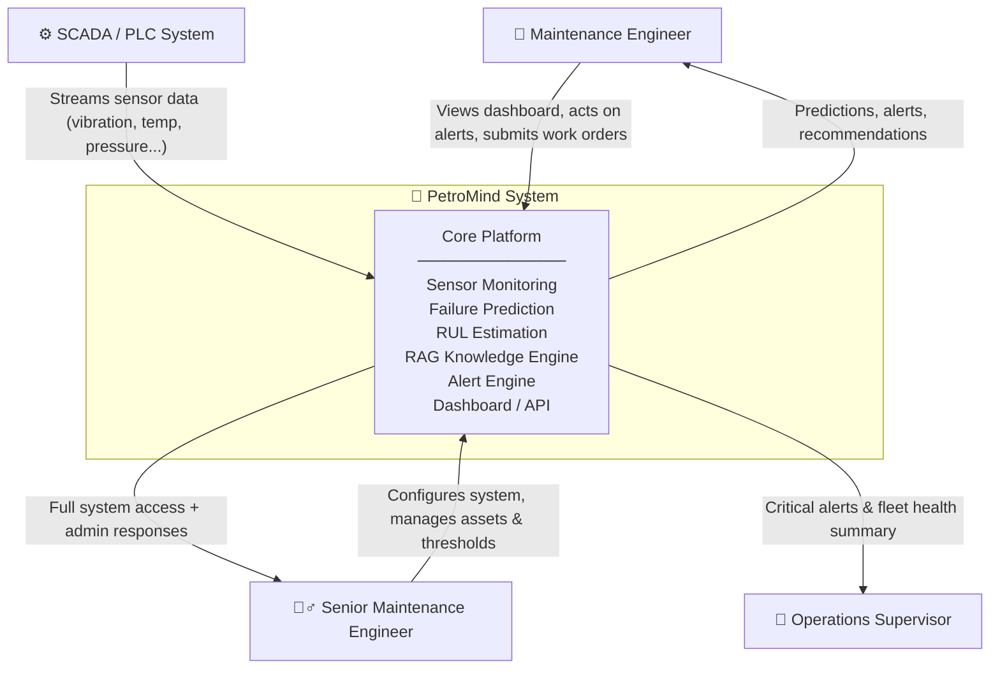

System Context Diagram

```mermaid
graph TD
    ME["👷 Maintenance Engineer"]
    SME["👷‍♂️ Senior Maintenance Engineer"]
    OS["👔 Operations Supervisor"]
    SCADA["⚙️ SCADA / PLC System"]

    subgraph PetroMind ["🧠 PetroMind System"]
        CORE["Core Platform<br/>─────────────<br/>Sensor Monitoring<br/>Failure Prediction<br/>RUL Estimation<br/>RAG Knowledge Engine<br/>Alert Engine<br/>Dashboard / API"]
    end

    SCADA -->|"Streams sensor data (vibration, temp, pressure...)"| CORE
    ME -->|"Views dashboard, acts on alerts, submits work orders"| CORE
    CORE -->|"Predictions, alerts, recommendations"| ME
    SME -->|"Configures system, manages assets & thresholds"| CORE
    CORE -->|"Full system access + admin responses"| SME
    CORE -->|"Critical alerts & fleet health summary"| OS
```
